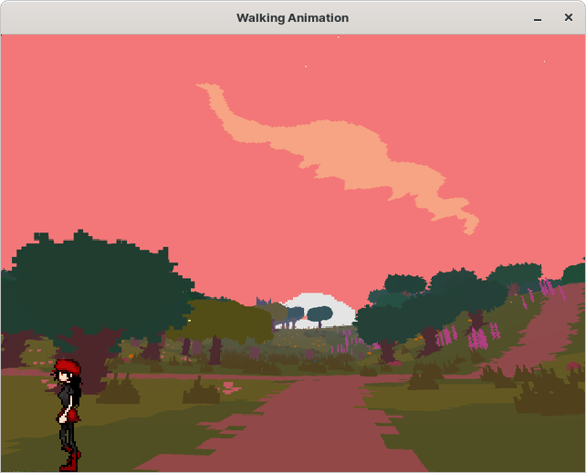

# Walking Animation
Programa en el cual se ve un personaje caminando, de izquierda y a derecha, en
bucle. Cuando llega a los bordes de la pantalla, da la vuelta.

# Modo de ejecución

    Ejecutar en terminal: python3 main.py
# Características

## Aplicación basada en uso de pygame como motor gráfico.

### ¿En qué consiste?

  - Una joven va caminando de izquierda a derecha. Cuando encuentra el final 
    de la pantalla, se da la vuelta, y prosigue, de derecha a izquierda. Cuando
    encuentra el final de la pantalla se da la vuelta. Se repite en bucle.

### Mejoras

    1) Si la joven tropieza con los límites de la pantalla, se produce un sonido
       de colisión.

    2) Si se pulsa la tecla de barra espaciadora, la joven salta y además se
       produce un sonido de "yeah".

    3) Se incluye un background, muy molón.

### Capturas de la aplicación

